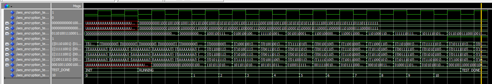
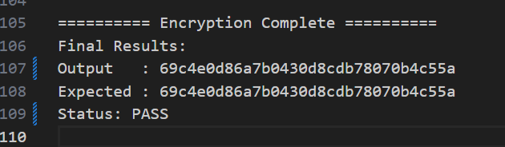
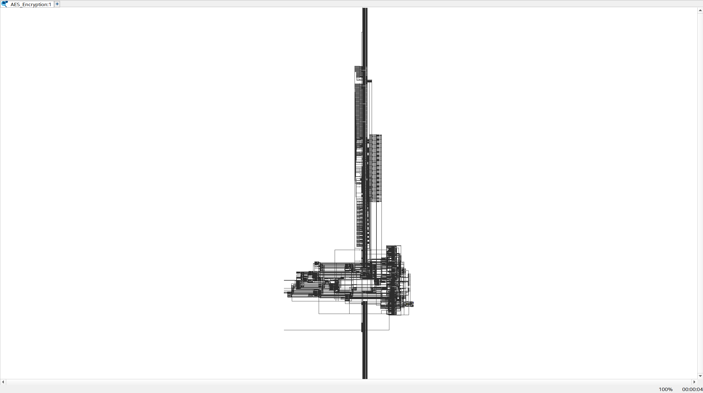
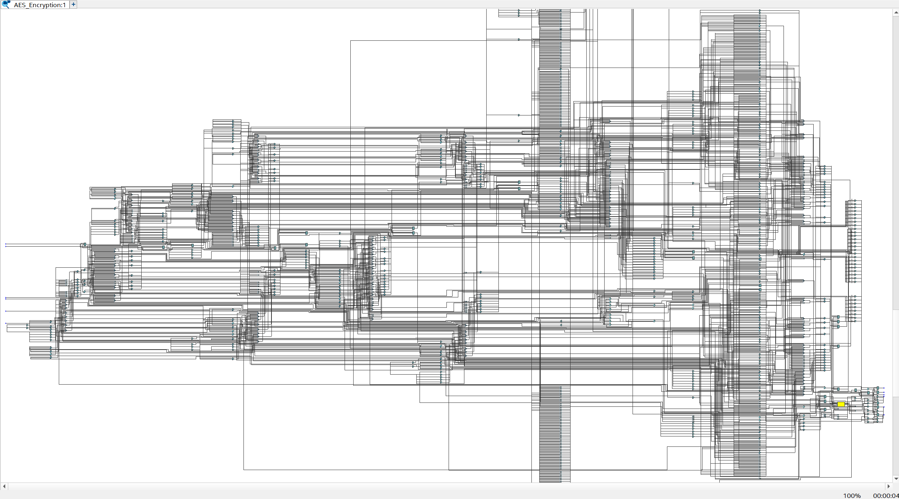

# ***PSD PA16 - AES Encryption Hardware Accelerator📌***

## **Hey There! 👋**
Repositori ini berisi pengumpulan proyek akhir praktikum PSD dari kelompok PA16. Pada repo ini, terdapat program `enkripsi`, `dekripsi`, serta `testbench`-nya masing - masing untuk implementasi VDHL dari algoritma enkripsi standar, yaitu *Advanced Encryption Standard* (AES). Repositori ini juga sudah berisi dokumentasi lengkap pembuatan proyek ini, yaitu dalam bentuk `laporan`, `powerpoint`, dan juga `readme` ini sendiri.

## **Background 🔎**
Keamanan data telah menjadi perhatian utama dalam era digital saat ini, di mana setiap informasi yang disimpan dan ditransmisikan dapat dengan mudah diakses oleh pihak yang tidak diinginkan. Oleh karena itu, dikembangkan berbagai metode-metode kriptografi yang mengenkripsi data supaya tidak bisa diinterpretasikan oleh pihak yang tidak berwenang. Salah satu metode kriptografi yang banyak digunakan untuk melindungi data adalah algoritma ***Advanced Encryption Standard*** **(AES)**.

## **How it Works 🛠️**
Algoritma AES pada umumnya, bekerja dengan mengenkripsi data dalam blok berukuran 128-bit dalam bentuk akselerator enkripsi untuk memproses enkripsi dan dekripsi data secara cepat dan efisien. Akselerator ini akan menggunakan teknik paralelisme dan pipelining untuk meningkatkan performa dari setiap operasi yang dilakukan oleh algoritma AES, yakni `SubBytes`, `ShiftRows`, `MixColumns`, dan `AddRoundKey`. Pada implementasi kami, algoritma ini akan dijalankan dalam 10 ronde dengan kunci 128-bit dan input *plaintext* data 128-bit, serta output berupa *ciphertext* 128-bit yang telah terenkripsi.

## **Code Implementation </>**
1. **AddRoundKey**
    ```vhdl
    for col in 0 to 3 loop
        for row in 0 to 3 loop
            state(row, col) <= state(row, col) xor 
                            current_round_key(127-8*(4*col+row) downto 120-8*(4*col+row));
        end loop;
    end loop;
    ```
    melakukan operasi XOR antara *state* pada saat ini dengan *round key* pada setiap *round*. Komponen ini bertujuan untuk meningkatkan keamanan dengan mencampur kunci pada setiap ronde yang didapatkan dari proses *key expansion*.

2. **SubBytes** (dan inversnya)
   - Enkripsi
    ```vhdl
    function sub_bytes(state_in: state_array) return state_array is
        variable result : state_array;
    begin
        for i in 0 to 3 loop
            for j in 0 to 3 loop
                result(i, j) := SBOX(to_integer(unsigned(state_in(i, j))));
            end loop;
        end loop;
        return result;
    end function;
    ```
   - Dekripsi
    ```vhdl
    function inv_sub_bytes(state_in: state_array) return state_array is
        variable result : state_array;
    begin
        for i in 0 to 3 loop
            for j in 0 to 3 loop
                result(i, j) := INV_SBOX(to_integer(unsigned(state_in(i, j))));
            end loop;
        end loop;
        return result;
    end function;
    ```
    melakukan substitusi *byte* pada setiap elemen *state* dengan menggunakan S-Box (*Substitution Box*) untuk proses enkripsi, dan Inverse S-Box untuk proses dekripsi. Komponen ini berfungsi untuk mengganti setiap elemen pada blok-blok data.

3. **ShiftRows** (dan inversnya)
   - Enkripsi
    ```vhdl
    function shift_rows(state_in: state_array) return state_array is
        variable result : state_array;
    begin
        -- Row 0: tidak bergeser
        result(0, 0) := state_in(0, 0);
        result(0, 1) := state_in(0, 1);
        result(0, 2) := state_in(0, 2);
        result(0, 3) := state_in(0, 3);
        
        -- Row 1: geser kiri 1
        result(1, 0) := state_in(1, 1);
        result(1, 1) := state_in(1, 2);
        result(1, 2) := state_in(1, 3);
        result(1, 3) := state_in(1, 0);
        
        -- Row 2: geser kiri 2
        result(2, 0) := state_in(2, 2);
        result(2, 1) := state_in(2, 3);
        result(2, 2) := state_in(2, 0);
        result(2, 3) := state_in(2, 1);
        
        -- Row 3: geser kiri 3
        result(3, 0) := state_in(3, 3);
        result(3, 1) := state_in(3, 0);
        result(3, 2) := state_in(3, 1);
        result(3, 3) := state_in(3, 2);

        return result;
    end function;
    ```
   - Dekripsi
    ```vhdl
    function inv_shift_rows(state_in: state_array) return state_array is
        variable result : state_array;
    begin
        -- Row 0: tidak bergeser
        result(0, 0) := state_in(0, 0);
        result(0, 1) := state_in(0, 1);
        result(0, 2) := state_in(0, 2);
        result(0, 3) := state_in(0, 3);

        -- Row 1: geser kanan 1
        result(1, 0) := state_in(1, 3);
        result(1, 1) := state_in(1, 0);
        result(1, 2) := state_in(1, 1);
        result(1, 3) := state_in(1, 2);

        -- Row 2: geser kanan 2
        result(2, 0) := state_in(2, 2);
        result(2, 1) := state_in(2, 3);
        result(2, 2) := state_in(2, 0);
        result(2, 3) := state_in(2, 1);

        -- Row 3: geser kanan 3
        result(3, 0) := state_in(3, 1);
        result(3, 1) := state_in(3, 2);
        result(3, 2) := state_in(3, 3);
        result(3, 3) := state_in(3, 0);

        return result;
    end function;
    ```
    melakukan pergeseran pada data dengan menggeser setiap baris *state* ke kiri sebanyak jumlah tertentu (sesuai baris) untuk proses enkripsi, dan ke kanan untuk proses dekripsi. Komponen ini berfungsi untuk menyebarkan data byte sehingga dapat memperkuat difusi pada data.

4. **MixColumns** (dan inversnya)
   - Enkripsi
    ```vhdl
    function mix_columns(state_in: state_array) return state_array is
        variable result : state_array;
    begin
        for col in 0 to 3 loop
            result(0, col) := gf_mult(X"02", state_in(0, col)) xor 
                            gf_mult(X"03", state_in(1, col)) xor 
                            state_in(2, col) xor 
                            state_in(3, col);
            
            result(1, col) := state_in(0, col) xor 
                            gf_mult(X"02", state_in(1, col)) xor 
                            gf_mult(X"03", state_in(2, col)) xor 
                            state_in(3, col);
            
            result(2, col) := state_in(0, col) xor 
                            state_in(1, col) xor 
                            gf_mult(X"02", state_in(2, col)) xor 
                            gf_mult(X"03", state_in(3, col));
            
            result(3, col) := gf_mult(X"03", state_in(0, col)) xor 
                            state_in(1, col) xor 
                            state_in(2, col) xor 
                            gf_mult(X"02", state_in(3, col));
        end loop;
        return result;
    end function;
    ```
   - Dekripsi
    ```vhdl
    function inv_mix_columns(state_in: state_array) return state_array is
        variable result : state_array;
    begin
        for col in 0 to 3 loop
            result(0, col) := gf_mult(X"0e", state_in(0, col)) xor
                            gf_mult(X"0b", state_in(1, col)) xor
                            gf_mult(X"0d", state_in(2, col)) xor
                            gf_mult(X"09", state_in(3, col));

            result(1, col) := gf_mult(X"09", state_in(0, col)) xor
                            gf_mult(X"0e", state_in(1, col)) xor
                            gf_mult(X"0b", state_in(2, col)) xor
                            gf_mult(X"0d", state_in(3, col));

            result(2, col) := gf_mult(X"0d", state_in(0, col)) xor
                            gf_mult(X"09", state_in(1, col)) xor
                            gf_mult(X"0e", state_in(2, col)) xor
                            gf_mult(X"0b", state_in(3, col));

            result(3, col) := gf_mult(X"0b", state_in(0, col)) xor
                            gf_mult(X"0d", state_in(1, col)) xor
                            gf_mult(X"09", state_in(2, col)) xor
                            gf_mult(X"0e", state_in(3, col));
        end loop;
        return result;
    end function;
    ```
    melakukan pencampuran data pada setiap kolom *state* dengan menggunakan operasi matematika *Galois Field* yang dibuat pada komponen terpisah. Komponen *MixColumns* ini bertujuan untuk memperkuat difusi antar *byte*.

5. **GfMult**
   ```vhdl
   function gf_mult(a, b: STD_LOGIC_VECTOR(7 downto 0)) return STD_LOGIC_VECTOR is
        variable p : STD_LOGIC_VECTOR(7 downto 0);
        variable hi_bit : STD_LOGIC;
        variable temp : STD_LOGIC_VECTOR(7 downto 0);
    begin
        p := (others => '0');
        temp := a;
        
        for i in 0 to 7 loop
            if (b(i) = '1') then
                p := p xor temp;
            end if;
            hi_bit := temp(7);
            temp := temp(6 downto 0) & '0';
            if (hi_bit = '1') then
                temp := temp xor X"1B";  -- Reduction polynomial
            end if;
        end loop;
        return p;
    end function;
    ```
    merupakan *function* yang digunakan untuk melakukan proses MixColumns dengan cara melakukan operasi perkalian pada *Galois Field* untuk menghasilkan data yang terenkripsi.

## **Testing 📝**
- **Wave Function using ModelSim**



- **Output File**




- **Synthesis using Quartus Prime**



- **Synthesis using Quartus Prime (Zoomed in)**




## **Authors ✍️**
| Group PA16 Members | Student Number |
| :----------------: | :------------: |
| [**@Fathan Yazid Satriani**](https://github.com/IfanFYS)| 2306250560 |
| [**@Mutia Casella**](https://github.com/mutiacasella)| 2306202870 |
| [**@Muhammad Rafli**](https://github.com/MRafli127)| 2306250730 |

